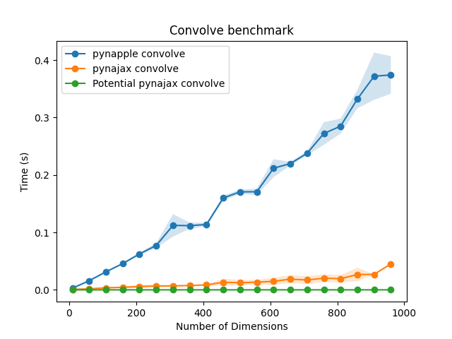

# pynajax

[](https://github.com/flatironinstitute/nemos/blob/main/LICENSE)

[](https://www.repostatus.org/#wip)
[](https://github.com/pynapple-org/pynajax/actions/workflows/ci.yml)


Welcome to `pynajax`, a GPU accelerated backend for [pynapple](https://github.com/pynapple-org/pynapple) built on top on [jax](https://github.com/google/jax). It offers a fast acceleration for the core pynapple functions using GPU. 

__The package is under active development and more methods will be added in the future.__


__For this package to work, `pynapple` must be installed from the branch `pynajax`.__


## Installation
Run the following `pip` command in your virtual environment.

**For macOS/Linux users:**
 ```bash
 pip install git+https://github.com/pynapple-org/pynajax.git
 ```

**For Windows users:**
 ```
 python -m pip install git+https://github.com/pynapple-org/pynajax.git
 ```


## Basic usage

To use pynajax, you need to change the pynapple backend using `nap.nap_config.set_backend`. See the example below : 

```python
import pynapple as nap
import numpy as np
nap.nap_config.set_backend("jax")

tsd = nap.Tsd(t=np.arange(100), d=np.random.randn(100))

tsd.convolve(np.ones(11)) # This will run on GPU or CPU depending on the jax installation
```

## Benchmarks

This benchmark for the `convolve` function was run on a NVIDIA GeForce GTX 1060.



## Disclaimer

Please note that this package is currently under development. While you can
download and test the functionalities that are already present, please be aware
that syntax and functionality may change before our preliminary release.

