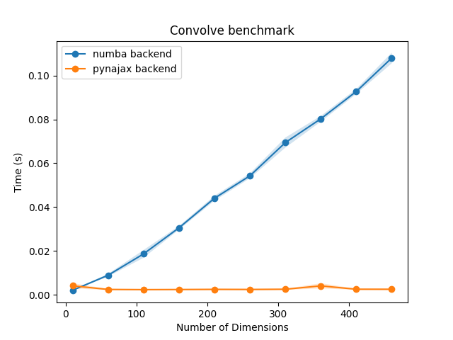

# pynajax 

[](https://github.com/pynapple-org/pynajax/blob/main/LICENSE)

[](https://www.repostatus.org/#active)
[](https://github.com/pynapple-org/pynajax/actions/workflows/ci.yml)
[](https://coveralls.io/github/pynapple-org/pynajax)


Welcome to `pynajax`, a GPU accelerated backend for [pynapple](https://github.com/pynapple-org/pynapple) built on top on [jax](https://github.com/google/jax). It offers a fast acceleration for the core pynapple functions using GPU. 


!!! warning

    This package is not meant to be used on its own. It should only be used through the pynapple API.


## Installation
Run the following `pip` command in your virtual environment.

**For macOS/Linux users:**
 ```bash
 pip install pynajax
 ```

**For Windows users:**
 ```
 python -m pip install pynajax
 ```

Alternatively, you can install pynapple and pynajax together.

```bash
 pip install pynapple[jax]
```

## Basic usage

To use pynajax, you need to change the pynapple backend using `nap.nap_config.set_backend`. See the example below : 

```python
import pynapple as nap
import numpy as np
nap.nap_config.set_backend("jax")

tsd = nap.Tsd(t=np.arange(100), d=np.random.randn(100))

# This will run on GPU or CPU depending on the jax installation
tsd.convolve(np.ones(11)) 
```

## Benchmark

This benchmark for the `convolve` function was run on a GPU.



See the documentation for others benchmarks.
